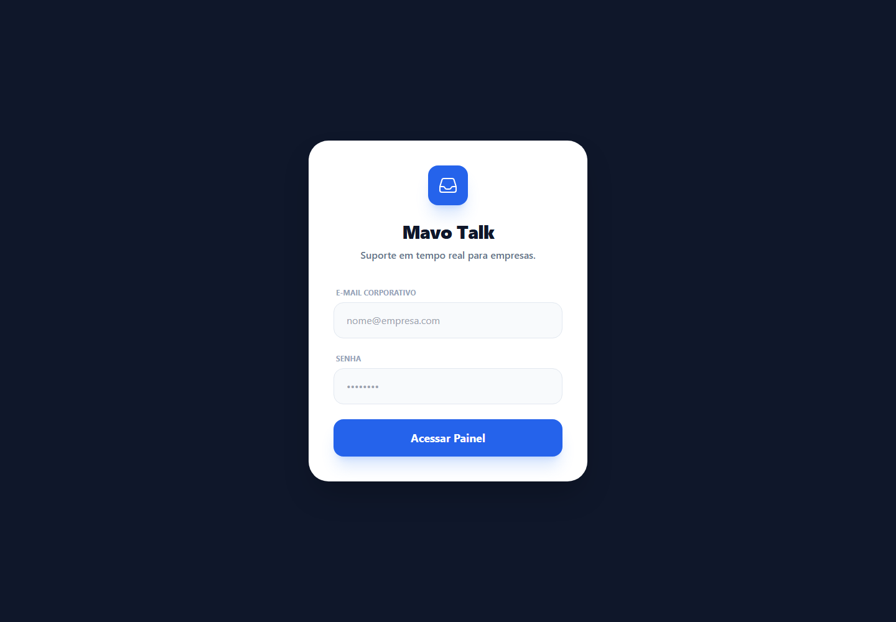
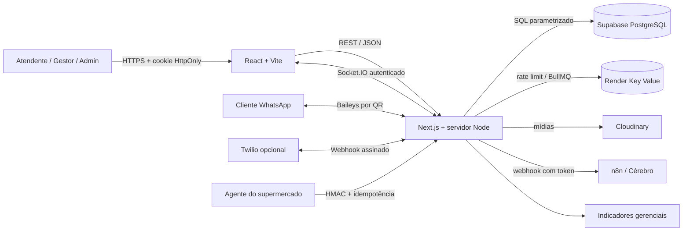
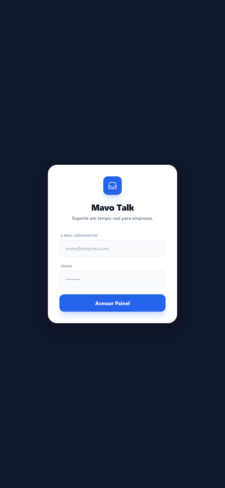
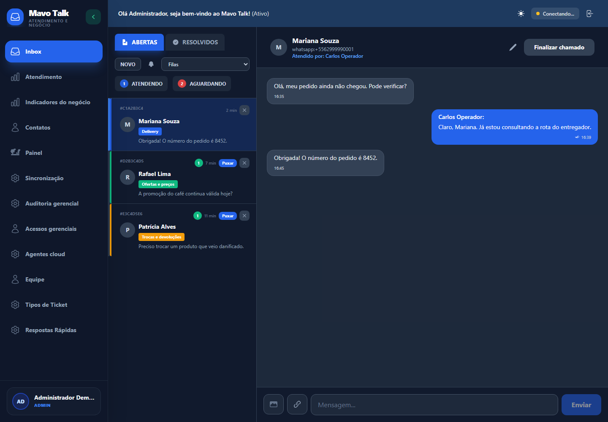
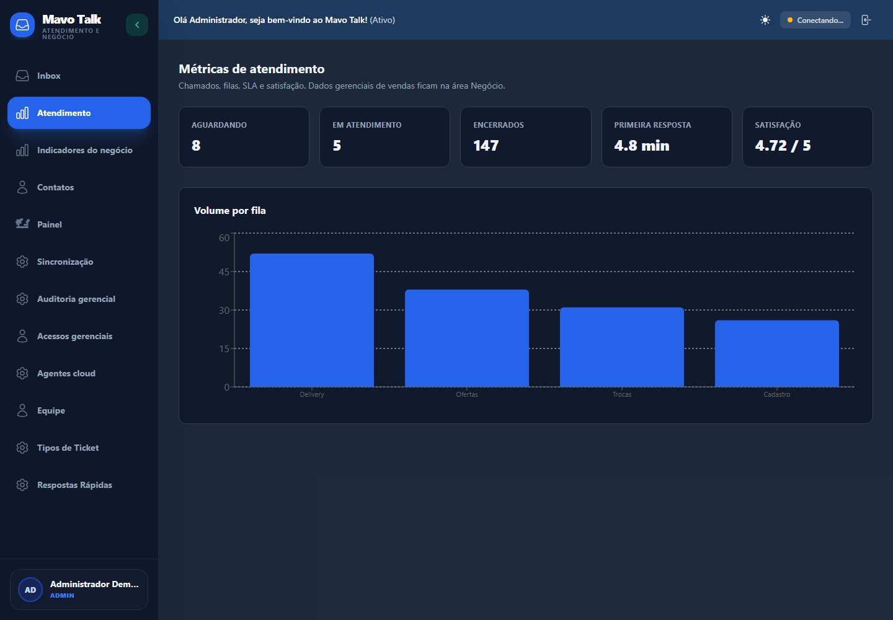
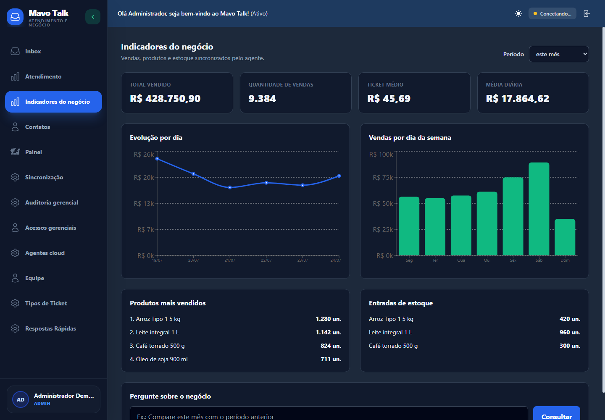
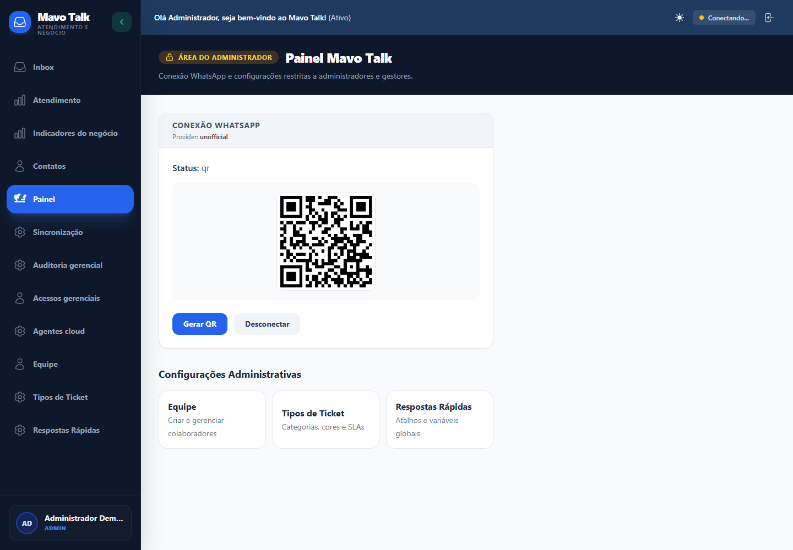
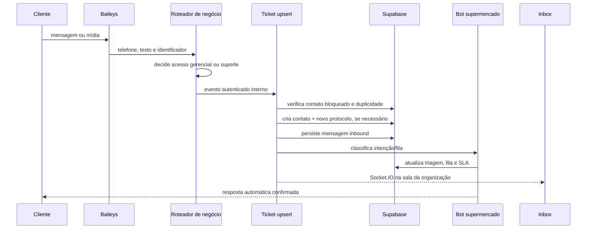
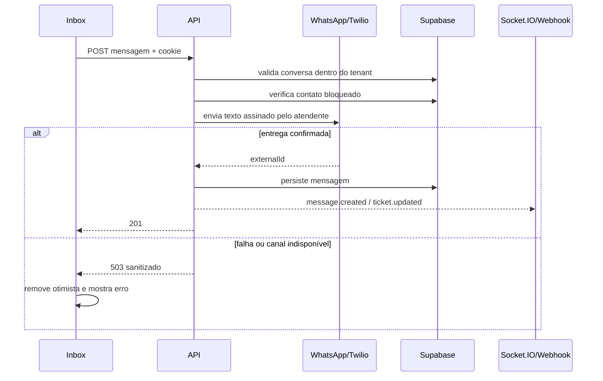

# WillTalk / Mavo Talk — Documentação técnica de produção

**Versão do documento:** 1.0

**Data da revisão:** 24 de julho de 2026

**Escopo:** frontend operacional, API, WhatsApp, bot de supermercado, sincronização gerencial, segurança, banco de dados e deploy Render/Supabase.

> Este documento descreve o código efetivamente auditado na branch `main`. As imagens marcadas como “demonstração” foram produzidas com o mesmo build do frontend e dados sintéticos, sem expor clientes, credenciais ou um QR real.

## 1. Visão executiva

O WillTalk é uma plataforma multiempresa de atendimento e inteligência operacional para supermercados. O sistema concentra conversas do WhatsApp em tickets, executa triagem automática, distribui os atendimentos por filas, mantém histórico e SLA, expõe indicadores de atendimento e recebe dados comerciais por um agente instalado no ambiente do cliente.

Em produção existem três recursos principais:

1. **`mavo-talk-web`**: SPA React/Vite servida como site estático no Render.
2. **`mavo-talk-api`**: Next.js com servidor HTTP próprio, Socket.IO, bot e workers inline.
3. **`mavo-talk-key-value`**: Redis/Key Value usado para rate limiting, filas BullMQ e coordenação transitória.

O dado durável fica no PostgreSQL do Supabase. O navegador nunca acessa o Supabase diretamente.



_Figura 1 — Tela pública real do build auditado._

## 2. Arquitetura



### 2.1 Componentes e responsabilidades

| Componente | Tecnologia | Responsabilidade |
| --- | --- | --- |
| Frontend | React 19, Vite, Tailwind, React Router, Recharts | Login, Inbox, contatos, métricas, administração e indicadores |
| API | Next.js 16, Node.js 22, TypeScript | Autorização, domínio, webhooks, integrações e páginas administrativas |
| Servidor | `server.cjs`, HTTP nativo, Socket.IO | CORS, WebSocket, ciclo de vida, workers inline e shutdown |
| Banco | PostgreSQL/Supabase | Dados transacionais, auditoria, analytics e sessão cifrada do WhatsApp |
| Repositório | `lib/supabase-repo.ts` | Acesso multi-tenant ao banco; todas as operações recebem `organizationId` |
| WhatsApp | Baileys | QR, recepção, envio e triagem sem Chromium |
| Fallback | Twilio | Canal oficial opcional, webhook assinado e redundância de envio |
| Filas | BullMQ/Redis | Webhooks, SLA e limpeza controlada de mídia |
| Mídia | Cloudinary | Armazenamento; a rota da UI verifica organização e conversa antes de redirecionar |
| Agente cloud | HMAC-SHA256 + AES-GCM | Ingestão de vendas, produtos, estoque e heartbeat |

## 3. Interfaces do sistema

### 3.1 Login e sessão

O login operacional chama `POST /api/auth/login`. Se as credenciais forem válidas, a API cria um JWT HS256 com `issuer` e `audience` fixos e o grava em cookie `HttpOnly`, `Secure` em produção e `SameSite=None` para o frontend separado da API. A SPA confirma a sessão em `GET /api/me` antes de mostrar qualquer área protegida; o valor em `localStorage` serve somente como cache visual e não concede acesso.



_Figura 2 — Login responsivo, renderizado em viewport móvel._

### 3.2 Inbox

A Inbox consulta as conversas da organização da sessão, separa tickets abertos e resolvidos, permite puxar ou finalizar atendimentos e recebe atualizações em tempo real. Uma mensagem otimista desaparece e um erro visível é exibido se o provedor não confirmar a entrega.



_Figura 3 — Build real com fixture sintética. Nenhum telefone ou ticket pertence a cliente real._

### 3.3 Métricas de atendimento

Gestores e administradores veem tickets aguardando, em atendimento e encerrados, tempo médio da primeira resposta, satisfação e volume por fila. A autorização é aplicada no frontend e novamente na API.



_Figura 4 — Métricas demonstrativas; valores não representam a produção._

### 3.4 Indicadores do supermercado

O agente cloud envia lotes diários de vendas, itens vendidos e entradas de estoque. O backend valida versão, assinatura, nonce, timestamp, checksum e chave de idempotência antes de gravar. O painel oferece séries temporais, ticket médio, produtos, estoque e consulta gerencial auditada.



_Figura 5 — Dados comerciais sintéticos usados apenas para documentação._

### 3.5 Administração do WhatsApp

Somente `admin` e `gestor` acessam status, telefone conectado, QR e comandos de conexão. O QR abaixo é deliberadamente inválido e contém apenas um marcador de documentação.



_Figura 6 — Fluxo visual de conexão; não é uma sessão real do WhatsApp._

### 3.6 Uso móvel

No mobile, a barra lateral vira drawer, a lista e a conversa ocupam a largura completa em estados alternados e existe ação explícita para voltar à lista. O teste visual executado em 390 px confirmou `scrollWidth=390`, sem overflow horizontal.


_Figura 7 — Conversa em viewport móvel, usando o build auditado._

## 4. Fluxos críticos

### 4.1 Mensagem recebida pelo WhatsApp/Baileys



Regras importantes:

- mensagens de grupo, broadcast, protocolo e ruído do Baileys são ignoradas;
- mensagens anteriores ao momento da conexão não disparam respostas retroativas;
- `external_id` evita duplicidade;
- um contato bloqueado não cria ticket nem alimenta automação;
- depois de um ticket encerrado, uma nova mensagem cria novo protocolo; o ticket antigo não é reaberto;
- mídia recebida acima de 16 MB é recusada;
- a triagem usa filas do preset de supermercado e encaminha ao humano quando falta configuração, sem inventar informação.

### 4.2 Mensagem enviada pelo atendente



A persistência ocorre somente depois da confirmação externa. Isso impede que o histórico declare como enviada uma mensagem que nunca saiu.

### 4.3 Upload de imagem

1. exige sessão válida, conversa do mesmo tenant e contato não bloqueado;
2. aceita JPEG, PNG, WebP ou GIF, até 8 MB;
3. envia ao Cloudinary;
4. entrega a URL pelo WhatsApp/Twilio;
5. persiste a mensagem somente após confirmação;
6. se a entrega falhar, remove o upload órfão;
7. a leitura posterior pela UI exige `publicId` + `conversationId` e confirma que a mídia pertence à organização autenticada.

Os uploads atuais ainda usam o delivery type público padrão do Cloudinary. A checagem da API impede enumeração pela aplicação, mas uma URL de origem já conhecida continua funcionando como bearer link. Não usar o fluxo atual para documentos de identidade ou outros anexos altamente sensíveis até migrar os assets para `authenticated` com URL temporária, ou servir o conteúdo por proxy autenticado sem retornar `media_url`.

### 4.4 Ciclo de vida do ticket

| Estado | Significado | Transição típica |
| --- | --- | --- |
| `pendente_cliente` | Bot ainda coleta informação | mensagem/seleção do cliente |
| `aguardando` | Pronto para uma fila humana | conclusão da triagem |
| `em_atendimento` | Atendente assumiu ou respondeu | `POST /assign` ou envio |
| `encerrado` | Atendimento finalizado | `POST /close` |

Fechar o ticket preserva mensagens e mídia. Exclusão de mídia deve obedecer uma política de retenção separada; ela não é mais vinculada ao fechamento operacional.

## 5. Autenticação e autorização

| Sigla | Mecanismo |
| --- | --- |
| **P** | Público ou idempotente, sem dado sensível |
| **U** | Cookie de sessão operacional; tenant obtido do JWT |
| **G** | Cookie operacional + papel `admin` ou `gestor` |
| **A** | Cookie operacional + papel `admin` |
| **M** | Cookie master separado, usado somente em `/mavo` |
| **H** | Credencial do agente + HMAC, timestamp, nonce e versão |
| **W** | Webhook: bearer token ou assinatura do provedor |

Princípios aplicados:

- autorização real sempre no backend;
- a organização nunca é aceita de um payload de usuário operacional;
- Socket.IO verifica JWT e revalida `/api/me` antes de entrar na sala `organization:<id>`;
- o gestor não pode criar, promover, alterar ou remover administradores;
- a última conta admin ativa e o próprio acesso administrativo são protegidos;
- respostas rápidas globais só podem ser alteradas por gestor/admin;
- QR e diagnóstico do WhatsApp não são expostos a atendentes;
- endpoints de mídia confirmam vínculo com tenant e conversa;
- CORS usa allowlist explícita e rejeita preflight ou requisição com origem indevida.

## 6. Catálogo de rotas

### 6.1 Sessão, saúde e assistência

| Método | Rota | Acesso | Função |
| --- | --- | --- | --- |
| POST | `/api/auth/login` | P | Autentica usuário, aplica rate limit e cria cookie |
| POST | `/api/auth/logout` | P | Limpa o cookie operacional |
| GET | `/api/me` | P/U | Retorna usuário da sessão ou `null` para o probe da SPA |
| GET | `/api/health` | P | Liveness: API, banco, Redis, WhatsApp e versão |
| GET | `/api/readiness` | P | Readiness do banco e Redis; retorna 503 se indisponível |
| POST | `/api/ai/support-assist` | U | Sugestão/resumo por IA, com rate limit e timeout |

### 6.2 Atendimento

| Método | Rota | Acesso | Função |
| --- | --- | --- | --- |
| GET | `/api/conversations` | U | Lista conversas, contatos, ticket e mensagens do tenant |
| POST | `/api/conversations/:id/assign` | U | Assume ticket e registra primeira resposta |
| POST | `/api/conversations/:id/close` | U | Encerra ticket e opcionalmente envia pesquisa |
| POST | `/api/conversations/:id/messages` | U | Envia e persiste texto após confirmação do canal |
| POST | `/api/conversations/:id/messages/upload` | U | Valida, envia e persiste imagem |
| POST | `/api/conversations/:id/typing` | U | Publica presença de digitação na sala do tenant |
| GET | `/api/contacts` | U | Lista contatos e última interação |
| PATCH | `/api/contacts/:id` | U | Atualiza nome, telefone, bloqueio e nota interna |
| POST | `/api/contacts/:id/start-conversation` | U | Cria ou obtém conversa aberta |
| GET | `/api/media/signed` | U | Redireciona para mídia assinada após checagem de posse |
| GET | `/api/queues` | U | Lista filas |
| POST | `/api/queues` | G | Cria fila |
| PATCH | `/api/queues/:id` | G | Atualiza fila, SLA, cor e estado |
| POST | `/api/queues/supermarket-preset` | G | Aplica preset de filas do supermercado |
| GET | `/api/quick-replies` | U | Lista respostas rápidas |
| POST | `/api/quick-replies` | G | Cria resposta rápida global |
| PATCH | `/api/quick-replies/:id` | G | Atualiza resposta rápida |
| DELETE | `/api/quick-replies/:id` | G | Remove resposta rápida |
| GET | `/api/dashboard/metrics` | G | Métricas gerenciais de atendimento |

### 6.3 Administração operacional

| Método | Rota | Acesso | Função |
| --- | --- | --- | --- |
| GET | `/api/admin/users` | A | Lista equipe ativa |
| POST | `/api/admin/users` | A | Cria usuário |
| PATCH | `/api/admin/users/:id` | A | Atualiza usuário sem permitir lockout do último admin |
| DELETE | `/api/admin/users/:id` | A | Desativa usuário |
| GET | `/api/admin/system-status` | G | Status sanitizado de serviços, agentes e versão |
| GET | `/api/admin/agents` | G | Lista instalações do agente cloud |
| POST | `/api/admin/agents/provision` | A | Provisiona agente e revela segredo uma vez |
| POST | `/api/admin/agents/:id/rotate-credential` | A | Rotaciona credencial |
| POST | `/api/admin/agents/:id/revoke` | A | Revoga agente |
| GET | `/api/admin/business-access` | A | Lista acessos gerenciais |
| POST | `/api/admin/business-access` | A | Cria acesso/PIN gerencial |
| PATCH | `/api/admin/business-access/:id` | A | Atualiza acesso |
| DELETE | `/api/admin/business-access/:id` | A | Revoga acesso |
| POST | `/api/admin/business-access/:id/reset-pin` | A | Redefine PIN |
| POST | `/api/admin/business-access/:id/revoke-sessions` | A | Revoga sessões ativas |
| POST | `/api/admin/business-access/:id/unlock` | A | Remove bloqueio por tentativas |

### 6.4 WhatsApp e integrações

| Método | Rota | Acesso | Função |
| --- | --- | --- | --- |
| GET | `/api/whatsapp/status` | G | Estado, QR, persistência e diagnóstico |
| POST | `/api/whatsapp/connect` | G | Inicializa/reconecta Baileys |
| POST | `/api/whatsapp/disconnect` | G | Encerra a sessão de forma controlada |
| POST | `/api/webhooks/twilio` | W | Recebe mensagens/status com assinatura Twilio |
| POST | `/api/webhooks/n8n/ticket-upsert` | W | Upsert idempotente, triagem e roteamento |
| POST | `/api/webhooks/cerebro/reply` | W | Resposta automática do Cérebro com bearer token |

### 6.5 Agente cloud e inteligência de negócio

| Método | Rota | Acesso | Função |
| --- | --- | --- | --- |
| GET | `/api/agent/v1/config` | H | Entrega configuração e próximo intervalo |
| POST | `/api/agent/v1/heartbeat` | H | Atualiza vida, versão e status do agente |
| POST | `/api/agent/v1/sync/sales-daily` | H | Ingestão idempotente de vendas diárias |
| POST | `/api/agent/v1/sync/product-sales` | H | Ingestão idempotente de vendas por produto |
| POST | `/api/agent/v1/sync/inventory-entries` | H | Ingestão idempotente de entradas de estoque |
| GET | `/api/business/analytics` | G | Agregações por período, produto e dia |
| POST | `/api/business/query` | G | Consulta gerencial com auditoria e rate limit |
| GET | `/api/business/audit` | A | Auditoria das consultas e acessos |

### 6.6 Console master Mavo

| Método | Rota | Acesso | Função |
| --- | --- | --- | --- |
| POST | `/api/mavo/auth/login` | P | Login master separado, com bloqueio por IP |
| POST | `/api/mavo/auth/logout` | P | Limpa cookie master |
| GET | `/api/mavo/overview` | M | Visão de saúde e pendências de configuração |
| POST | `/api/mavo/actions/sync-supermarket` | M | Reaplica preset do supermercado |

Páginas do backend: `/mavo` é o console master; `/`, `/login`, `/dashboard` e `/dashboard/queues` redirecionam para o frontend canônico em produção.

## 7. Banco de dados

### 7.1 Tabelas

| Domínio | Tabelas |
| --- | --- |
| Tenant e usuários | `organizations`, `users`, `audit_logs`, `business_hours`, `channels` |
| Atendimento | `contacts`, `queues`, `conversations`, `tickets`, `messages`, `quick_replies` |
| Acesso gerencial | `business_access_users`, `business_access_sessions`, `business_access_audit`, `business_whatsapp_events`, `business_query_audit` |
| Agente cloud | `agent_installations`, `agent_credentials`, `agent_nonces`, `agent_sync_batches`, `agent_audit_events` |
| Analytics | `business_sales_daily`, `business_product_sales_daily`, `business_inventory_entries_daily` |
| WhatsApp | `whatsapp_auth_state` |
| Migrações | `mavo_schema_migrations` |

### 7.2 Isolamento

As tabelas de negócio carregam `organization_id`. As migrations ativam RLS e criam políticas baseadas em `mavo_current_organization_id()`. A aplicação também filtra explicitamente por organização em selects e updates, oferecendo defesa em profundidade.

`whatsapp_auth_state` guarda somente conteúdo cifrado com AES-256-GCM. A chave de produção vem de `WHATSAPP_AUTH_ENCRYPTION_KEY`, com fallback de derivação estável do JWT apenas para compatibilidade de rollout. Trocar a chave com sessão existente torna o estado ilegível e exige novo QR.

### 7.3 Migrações

Ordem atual:

1. `202607230000_base_support_schema.sql`
2. `202607230001_business_access.sql`
3. `202607230002_agent_cloud.sql`
4. `202607230003_business_analytics.sql`
5. `202607230004_rls_policies.sql`
6. `202607230005_indexes.sql`
7. `202607240006_whatsapp_auth_state.sql`
8. `202607240007_protect_last_admin.sql`

`npm run db:migrate` usa checksum e não reaplica arquivos já registrados. Nunca edite uma migration aplicada; crie a próxima.

## 8. Configuração de ambiente

### 8.1 Obrigatórias em produção

| Grupo | Variáveis |
| --- | --- |
| Banco | `DB_PROVIDER=supabase`, `DATABASE_URL_RUNTIME`, `DATABASE_URL_MIGRATIONS`, `PG_SSL=true` |
| Sessão | `JWT_SECRET` com pelo menos 32 caracteres, `SESSION_COOKIE_NAME`, `SESSION_COOKIE_SAME_SITE` |
| Rede | `FRONTEND_URL`, `MAVO_ALLOWED_ORIGINS`, `MAVO_API_PUBLIC_URL` |
| Redis | `REDIS_URL`, `MAVO_QUEUE_ENV` |
| Tenant | `DEFAULT_ORG_ID`, `WILLTALK_WEBHOOK_ORGANIZATION_ID` |
| WhatsApp QR | `WHATSAPP_PROVIDER=unofficial`, `WHATSAPP_AUTH_STORE=database`, `WHATSAPP_AUTH_ENCRYPTION_KEY`, `WHATSAPP_SESSION_NAME` |
| Agente | `MAVO_AGENT_CREDENTIAL_ENCRYPTION_KEY` com 32 bytes em base64 |
| Master | `MAVO_MASTER_EMAIL`, `MAVO_MASTER_PASSWORD` ou hash |

### 8.2 Dados reais da loja

Preencher `SUPERMARKET_NAME`, endereço, link do mapa, horários, ofertas, pedidos, delivery e telefone. Quando um campo está ausente, o bot encaminha a uma pessoa. Consulte [BOT-SUPERMERCADO.md](BOT-SUPERMERCADO.md).

### 8.3 Opcionais

- `TWILIO_*`: fallback oficial;
- `CLOUDINARY_*`: upload de mídia;
- `MAVO_AI_BASE_URL` e `MAVO_AI_TOKEN`: assistência externa;
- `VISION_*`: análise de imagem;
- `CEREBRO_*`: orquestração e auto-reply.

Nenhum segredo deve usar prefixo `VITE_`; tudo que começa com esse prefixo entra no bundle público.

## 9. Deploy no Render

O Blueprint está em `render.yaml` e executa:

```text
npm ci --include=dev
npm run typecheck
npm test
npm run lint
npm run build
npm run db:migrate
npm run db:bootstrap:production
npm run db:verify
```

O bootstrap garante a organização padrão de modo idempotente. `db:verify` falha quando faltam tabelas ou RLS; a existência da organização padrão deixa de bloquear o primeiro deploy porque o bootstrap roda antes.

O frontend executa typecheck e build Vite. Os dois serviços recebem headers de segurança, incluindo HSTS, CSP, `frame-ancestors 'none'`, `nosniff`, Referrer Policy, Permissions Policy e COOP.

Consulte [DEPLOY-SUPABASE-RENDER.md](DEPLOY-SUPABASE-RENDER.md) para o passo a passo.

### 9.1 Limite do plano gratuito

O plano atual é adequado para homologação ou produção controlada, mas não oferece SLA de varejo:

- o web service pode hibernar;
- o bot fica offline durante hibernação/restart;
- Redis gratuito não é persistente;
- workers rodam dentro da API;
- não há disco persistente;
- a sessão do WhatsApp sobrevive porque está cifrada no Supabase.

Para operação 24x7, usar instância paga sempre ativa, Redis persistente e worker separado. Um monitor externo reduz cold start, mas não substitui SLA.

## 10. Segurança

Controles implementados na revisão:

- CORS allowlist e preflight fail-closed;
- headers CSP/HSTS/anti-frame;
- cookie HttpOnly e validação de sessão no servidor;
- RBAC em todas as rotas sensíveis;
- proteção contra elevação de gestor para admin;
- preservação obrigatória de ao menos um admin ativo;
- rate limit em login, IA, agente e consultas;
- assinatura HMAC com nonce e tolerância de relógio para agente;
- assinatura Twilio e bearer tokens comparados em tempo constante;
- limites de payload e comprimento de campos;
- tamanho e MIME de uploads;
- mensagens persistidas somente após confirmação externa;
- rota de mídia com verificação de tenant e conversa antes do redirecionamento;
- erros públicos sanitizados;
- logs estruturados sem PIN, senha, token, e-mail ou telefone em auditoria sanitizada;
- RLS e filtros explícitos de tenant;
- dependências críticas corrigidas por upgrades/overrides.

### 10.1 Exceção conhecida do audit

O audit do frontend aponta a advisory de React Router para **RSC Mode**. Esta aplicação é uma SPA Vite em modo declarativo e não usa RSC, framework mode, server actions ou loaders no servidor; portanto o vetor não é aplicável ao runtime atual. A versão permanece em 7.18.x porque ela contém as correções de open redirect das versões anteriores. A exceção deve ser reavaliada em todo upgrade ou se o frontend migrar para RSC.

### 10.2 Risco residual de mídia

O endpoint `/api/media/signed` confirma que o `publicId` pertence à conversa e à organização da sessão. Entretanto, os uploads existentes usam o delivery type `upload` do Cloudinary, e a assinatura atual não fornece expiração real para o asset de origem. Tratar a URL como segredo compartilhável e:

1. proibir anexos altamente sensíveis no go-live atual;
2. migrar novos uploads para assets `authenticated` e URLs temporárias, testando Baileys, Twilio e visão;
3. deixar de expor `media_url` quando houver `cloudinary_public_id`;
4. avaliar migração dos assets históricos e política de retenção com o responsável LGPD.

## 11. Observabilidade e operação

| Verificação | Endpoint/ação | Resultado saudável |
| --- | --- | --- |
| Liveness | `GET /api/health` | HTTP 200, banco conectado |
| Readiness | `GET /api/readiness` | HTTP 200, banco e Redis conectados |
| Sistema | `GET /api/admin/system-status` | serviços e agentes sem erro |
| WhatsApp | `GET /api/whatsapp/status` | `ready`; `qr` exige leitura |
| Banco | `npm run db:verify` | sem tabela/RLS ausente |
| Blueprint | `npm run render:validate` | schema válido |
| Logs | Render API | sem loop de reconnect, 5xx ou falha de migration |

O shutdown trata `SIGTERM`/`SIGINT`, fecha workers e Redis e chama `end()` no socket Baileys. O timeout do processo é o último fallback.

## 12. Testes e evidências da revisão

| Etapa | Resultado em 24/07/2026 |
| --- | --- |
| Testes Node | 70 aprovados, 0 falhas |
| TypeScript backend | aprovado |
| TypeScript frontend | aprovado |
| ESLint | 0 erros, 0 warnings |
| Build Next.js | aprovado; 39 páginas/rotas geradas |
| Build Vite | aprovado; chunks e assets gerados |
| Blueprint Render | válido |
| Audit produção backend | 0 vulnerabilidades |
| Audit frontend | advisory RSC não aplicável, documentada acima |
| Visual desktop | login, Inbox, métricas, negócio e WhatsApp inspecionados |
| Visual mobile | 390 px, sem overflow horizontal |

Os testes de regressão cobrem: falha de entrega antes da persistência, limite e cleanup de upload, isolamento de mídia, protocolo novo após encerramento, bloqueio nos três canais, restrição do QR, shutdown Baileys, proteção de administradores e métricas gerenciais.

As capturas podem ser reproduzidas com `scripts/generate-doc-screenshots.mjs`, usando Chrome com CDP e um frontend local. O script intercepta somente a execução de documentação e usa fixtures sintéticas.

## 13. Runbook

### WhatsApp mostra `qr`

1. entrar no frontend como admin/gestor;
2. abrir **Painel**;
3. no celular: WhatsApp → Aparelhos conectados → Conectar aparelho;
4. ler o QR;
5. aguardar `ready`;
6. enviar mensagem real de teste e confirmar Inbox + resposta.

### Health 503

1. abrir logs do Render;
2. validar `DATABASE_URL_RUNTIME`, `PG_SSL=true` e pooler;
3. validar `REDIS_URL`;
4. executar `npm run db:verify` contra o mesmo banco;
5. não rodar seed destrutivo nem apagar migrations.

### Mensagem não sai

1. consultar status do WhatsApp;
2. confirmar contato não bloqueado e telefone normalizado;
3. verificar Cloudinary para imagem;
4. procurar 503 e request id nos logs;
5. nunca inserir manualmente uma mensagem “enviada” para mascarar falha.

### Bot responde informação errada ou transfere demais

1. conferir `SUPERMARKET_*`;
2. revisar filas/preset;
3. conferir horário comercial;
4. validar se `SUPERMARKET_BOT_ENABLED=true`;
5. manter fallback de IA desligado até ter base confiável.

### Agente não sincroniza

1. conferir heartbeat e versão no painel;
2. validar relógio da máquina;
3. conferir Agent ID, segredo e versão da chave;
4. verificar nonce reutilizado e `Idempotency-Key`;
5. rotacionar credencial somente se houver suspeita de vazamento.

## 14. Backup, retenção e recuperação

- habilitar backups/PITR compatíveis com o plano do Supabase;
- testar restauração em projeto separado, nunca sobre produção;
- definir retenção de mensagens e mídia com o responsável pelo negócio/LGPD;
- não apagar mídia ao fechar tickets;
- guardar as chaves de cifra em cofre de secrets;
- documentar a troca planejada de chaves; troca sem migração revoga dados cifrados;
- exportar periodicamente configurações de filas, horários e usuários administrativos.

RPO e RTO devem ser definidos pelo contratante. O código não substitui uma política de backup da infraestrutura.

## 15. Checklist antes de liberar a loja

- [ ] Deploy de API e frontend no mesmo commit.
- [ ] `/api/health` e `/api/readiness` em HTTP 200.
- [ ] Organização padrão existente e `db:verify` aprovado.
- [ ] Conta admin real validada e segunda conta admin de contingência criada.
- [ ] `SUPERMARKET_*` preenchidas com dados confirmados pela loja.
- [ ] Filas, SLAs e horários revisados pelo gerente.
- [ ] QR do WhatsApp lido e status `ready`.
- [ ] Teste inbound, outbound, imagem, bloqueio e encerramento concluído.
- [ ] Novo contato após encerramento cria novo protocolo.
- [ ] Agente cloud sincroniza e indicadores batem com uma amostra do ERP.
- [ ] Cloudinary, Twilio e IA validados somente se habilitados.
- [ ] Upload de documentos sensíveis bloqueado até o Cloudinary usar assets autenticados ou proxy.
- [ ] Backup e restauração testados.
- [ ] Monitoramento, alertas e responsável de plantão definidos.
- [ ] Plano Render compatível com disponibilidade 24x7.
- [ ] Aviso de privacidade, retenção e base legal LGPD aprovados.

## 16. Arquivos de referência

- `render.yaml` — infraestrutura declarativa;
- `.env.example` e `frontend/.env.example` — contrato de configuração;
- `supabase/migrations/` — schema versionado;
- `lib/config/runtime-env.cjs` — validação fail-fast;
- `lib/supabase-repo.ts` — repositório multi-tenant;
- `lib/whatsapp-client.ts` — integração Baileys;
- `app/api/` — rotas descritas neste catálogo;
- [agent-cloud-api.md](agent-cloud-api.md) — protocolo do agente;
- [security-business-access.md](security-business-access.md) — acesso gerencial;
- [business-whatsapp-flow.md](business-whatsapp-flow.md) — roteamento pelo WhatsApp;
- [BOT-SUPERMERCADO.md](BOT-SUPERMERCADO.md) — comportamento da Mavi;
- [DEPLOY-SUPABASE-RENDER.md](DEPLOY-SUPABASE-RENDER.md) — instalação e deploy.
