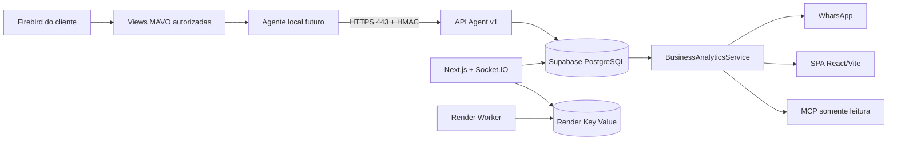
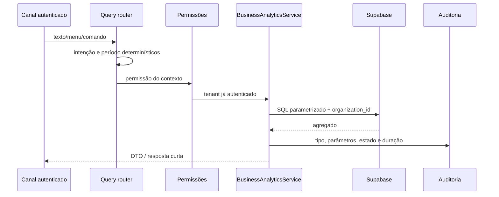
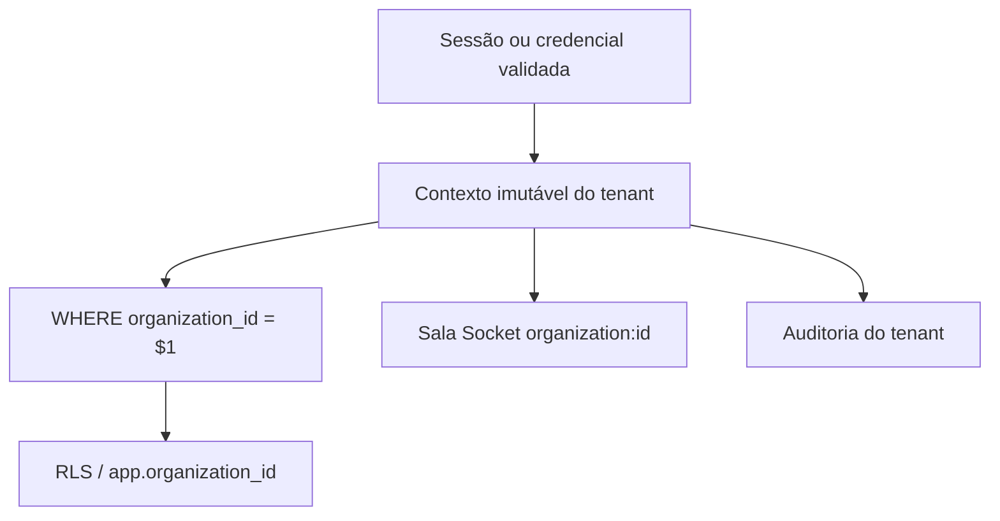

# Arquitetura de analytics do Mavo Talk

## Resultado do diagnóstico

A fonte final da verdade observada no runtime era o código, não o Prisma. A SPA
ativa está em `frontend/`; a interface Next.js é legada. O arquivo
`scripts/supabase-schema.sql` era o bootstrap SQL efetivo e
`prisma/schema.prisma` não participava da persistência em runtime.

As divergências relevantes encontradas foram:

- `lib/repo.ts` podia alternar silenciosamente entre PostgreSQL e Firestore;
- o provider local chamado `postgres` usava um shim compatível com Supabase,
  mas não comprovava conexão com um projeto Supabase;
- o ticket era criado antes de distinguir consumidor de gestor;
- Socket.IO emitia eventos globais e aceitava CORS amplo;
- o Vite tinha uma integração Gemini capaz de levar chave ao navegador;
- o dashboard ativo usava `mockData`, apesar de existir API de métricas;
- `server.cjs` estava orientado às portas locais e o Blueprint não representava
  a topologia completa;
- não havia migrations versionadas para acesso gerencial, agente ou analytics.

Após a consolidação, `DB_PROVIDER=supabase` é obrigatório em produção,
`lib/repo.ts` não importa nem usa Firestore, e `supabase/migrations/` é a fonte
autoritativa de evolução estrutural. `scripts/supabase-schema.sql` permanece
somente como baseline legado.

## Visão final

O agente inicia toda conexão. Não existe conexão cloud → Firebird, porta de
entrada no cliente ou SQL remoto arbitrário.

## Separação interna

- `lib/business-access/`: identidade, PIN/MFA, sessão, autorização e roteamento
  pré-ticket;
- `lib/business-analytics/`: períodos, intenções determinísticas, consultas
  parametrizadas, DTOs e formatação de WhatsApp;
- `lib/agent-cloud/`: autenticação HMAC, replay protection, validação,
  idempotência, ingestão e status;
- `lib/mcp/`: registry e servidor MCP real, usando o mesmo serviço de analytics;
- `lib/db.ts`: pool PostgreSQL singleton e transações com contexto de tenant;
- `app/api/**`: autentica, valida, resolve tenant, chama serviço e responde.

Não há cálculo financeiro duplicado entre WhatsApp, UI e MCP.

## Modelo de dados

As migrations são aplicadas na ordem:

1. `202607230000_base_support_schema.sql`;
2. `202607230001_business_access.sql`;
3. `202607230002_agent_cloud.sql`;
4. `202607230003_business_analytics.sql`;
5. `202607230004_rls_policies.sql`;
6. `202607230005_indexes.sql`.

O preflight da última migration interrompe a execução caso existam
`external_id` duplicados em `messages`. Ele não apaga nem consolida histórico
automaticamente.

Os agregados usam as seguintes chaves de upsert:

| Dado | Chave |
|---|---|
| vendas diárias | `organization_id, sale_date` |
| vendas de produto | `organization_id, sale_date, product_id` |
| entrada de estoque | `organization_id, entry_date, product_id` |
| lote | `agent_id, batch_id` |

Uma atualização só substitui o agregado quando seu `source_updated_at` não é
mais antigo que o valor persistido.

## Consulta gerencial

O contexto carrega o tenant da sessão web, credencial do agente ou identidade
MCP. Nenhum método recebe `organization_id` livre da IA.

Períodos suportados: hoje, ontem, esta semana, semana passada, este mês, mês
passado, últimos 7/15/30/60/90 dias e intervalo explícito de até 366 dias.
Timezone padrão: `America/Sao_Paulo`; moeda: `BRL`.

## Isolamento

O backend usa conexão PostgreSQL privilegiada para autenticar credenciais e
mantém filtros explícitos em todas as consultas. As policies RLS negam acesso
quando `app.organization_id` não está definido e constituem uma segunda
barreira para conexões não privilegiadas. A service role nunca é exposta à SPA.

## Compatibilidade preservada

Login por cookie JWT, inbox, QR Code, `whatsapp-web.js`, Twilio, Cloudinary,
filas, respostas rápidas, encerramento, satisfação, webhooks e integração com
Mavo AI continuam nos fluxos existentes. Nomes internos `WILLTALK_*` necessários
à compatibilidade não foram renomeados cegamente; a marca visível é Mavo Talk.

Após confirmar que não havia importação ativa, os arquivos de repositório/seed
Firestore e a dependência `firebase-admin` foram removidos. Não existe
dual-write, fallback silencioso nem dependência Firebase no runtime.
