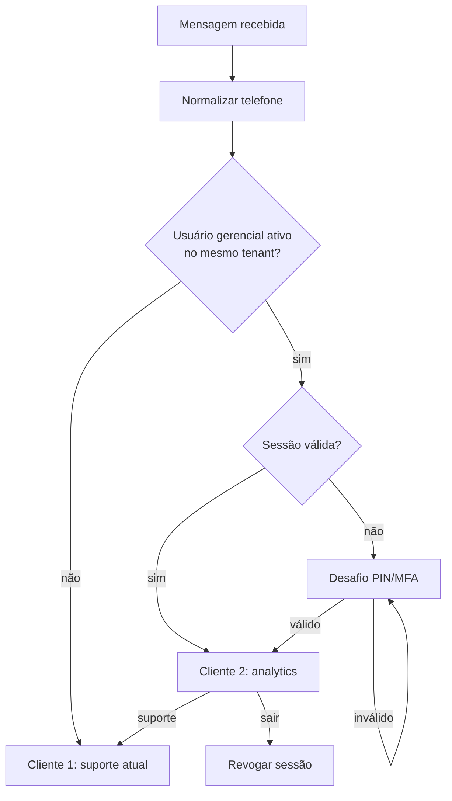
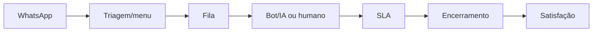
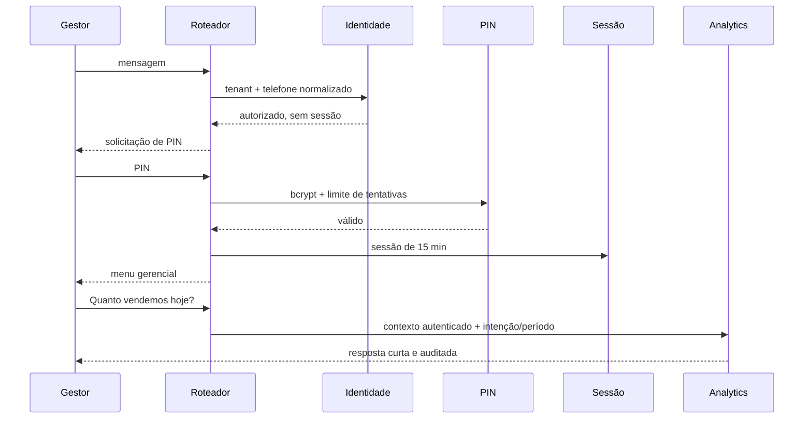

# Fluxos de WhatsApp

## Ponto de decisão

A decisão gerencial ocorre nos três caminhos de entrada — `whatsapp-web.js`,
Twilio e ticket-upsert — antes de contato, conversa ou ticket.



Uma consulta gerencial não cria `contact`, `conversation`, `ticket` ou
`message` de suporte. Ela gera `business_whatsapp_events`,
`business_access_audit` e `business_query_audit`.

## Cliente 1



Números desconhecidos ou não ativos seguem exatamente esse fluxo. Nenhuma
mensagem revela se um telefone está cadastrado na lista interna.

## Cliente 2



Menu inicial:

```text
1 — Resumo de vendas
2 — Total vendido
3 — Produtos mais vendidos
4 — Média de vendas por dia
5 — Vendas por data
6 — Vendas por dia da semana
7 — Entradas de estoque
8 — Produtos com menor venda
9 — Comparar períodos
10 — Fazer uma pergunta sobre o negócio
```

Números e linguagem natural funcionam. A ordem de resolução é menu/comando,
intenção conhecida e fallback orientando o usuário. Valores nunca são
calculados pela IA.

## Comandos de estado

- `suporte`, `falar com atendente`, `abrir chamado`: ativa modo suporte e a
  mensagem seguinte percorre Cliente 1;
- `menu gerencial`, `voltar ao gerencial`, `modo gerencial`: encerra o desvio
  temporário para suporte;
- `sair`, `encerrar sessão`, `bloquear acesso`: revoga a sessão imediatamente.

O modo suporte não elimina a autorização, mas somente o usuário autenticado
pode voltar ao gerencial. Sessão vencida sempre exige autenticação novamente.

## PIN e bloqueio

O PIN tem de 6 a 12 dígitos, é armazenado com bcrypt custo 12 e nunca aparece em
logs. A quinta falha bloqueia pelo intervalo configurado. Depois que uma trava
expira, começa uma nova janela de tentativas. Redefinir PIN, desativar acesso ou
revogar sessões invalida a sessão atual.

Exemplo sem dados:

```text
Ainda não há dados sincronizados para esse período.
A última atualização ocorreu em 22/07/2026 08:30.
```

O formatter limita rankings e séries para evitar mensagens enormes.
