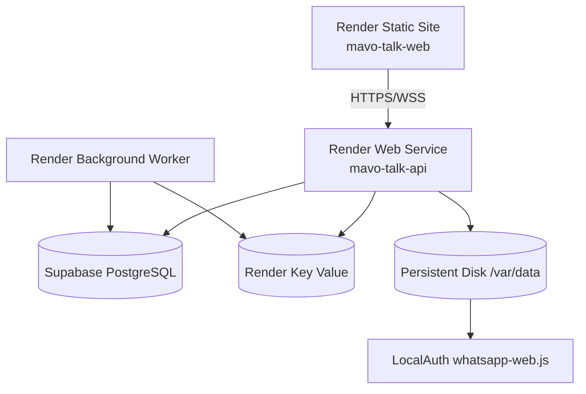

# Deploy cloud: Supabase + Render

## Topologia



`render.yaml` não cria Render PostgreSQL. Todos os serviços computacionais e o
Key Value estão em `virginia`. Ajuste a região somente antes do primeiro
provisionamento, considerando a região do projeto Supabase.

O Blueprint foi validado com:

```bash
npm run render:validate
```

## Supabase

Use projetos separados para desenvolvimento, homologação e produção.

1. configure `DATABASE_URL_MIGRATIONS` com conexão direta ou Session Pooler
   apropriado para administração;
2. configure `DATABASE_URL_RUNTIME` com conexão persistente/Supavisor Session
   Pooler compatível com o driver `pg`;
3. confirme SSL e IPv4/IPv6 do plano;
4. aplique:

```bash
npm ci
npm run db:migrate:status
npm run db:migrate
npm run db:verify
```

O pool é singleton. `PG_POOL_MAX`, timeouts e nome da aplicação são
configuráveis. Não use Transaction Pooler em rotinas que dependam de estado de
sessão/transação. Não execute `db:seed:development` em produção.

## Serviços Render

### `mavo-talk-api`

- plano pago `starter`;
- `numInstances: 1`;
- `npm run start`, escutando `0.0.0.0:$PORT`;
- HTTP, Next.js e Socket.IO no mesmo servidor;
- disco de 1 GB em `/var/data`;
- health check `/api/health`;
- migration aditiva e verificação no pre-deploy.

### `mavo-talk-web`

- root `frontend`;
- build `npm ci && npm run typecheck && npm run build`;
- publish `dist`;
- rewrite `/* → /index.html`;
- apenas `VITE_API_BASE_URL` e `VITE_SOCKET_URL` no bundle.

### `mavo-talk-worker`

- `npm run worker`;
- consome filas `mavo-talk-production-*` (BullMQ reserva `:` em nomes de fila);
- não inicia WhatsApp;
- shutdown gracioso.

### `mavo-talk-key-value`

- plano pago, `noeviction`, `journal-snapshot`;
- sem acesso público (`ipAllowList: []`);
- filas, cache, limites, nonce, locks e deduplicação.

## WhatsApp não oficial

Variáveis:

```text
WHATSAPP_PROVIDER=unofficial
WHATSAPP_AUTH_PATH=/var/data/wwebjs_auth
WHATSAPP_SESSION_NAME=mavo-talk-production
WHATSAPP_AUTO_CONNECT=true
```

Somente caminhos sob `/var/data` persistem. Não execute o cliente no worker e
não conecte duas instâncias à mesma sessão. O primeiro acesso exibe QR Code no
Painel. A sessão deve sobreviver a restart/redeploy, mas um deploy com disco tem
breve indisponibilidade e não oferece zero downtime.

Se houver corrupção, preserve snapshot do disco, revogue a sessão no aparelho e
remova somente o diretório específico da sessão durante janela de manutenção.
Nunca apague `/var/data` inteiro automaticamente.

## Variáveis obrigatórias

No Web Service, informar pelo painel:

- `DATABASE_URL_RUNTIME`, `DATABASE_URL_MIGRATIONS`;
- `SUPABASE_URL`, `SUPABASE_ANON_KEY`, `SUPABASE_SERVICE_ROLE_KEY` quando usados;
- `FRONTEND_URL`, `MAVO_ALLOWED_ORIGINS`;
- `DEFAULT_ORG_ID`, `WILLTALK_WEBHOOK_ORGANIZATION_ID`;
- `MAVO_MASTER_EMAIL`, senha/hash;
- Cloudinary e Mavo AI.

`JWT_SECRET` e o token legado podem ser gerados pelo Blueprint. Para
`MAVO_AGENT_CREDENTIAL_ENCRYPTION_KEY`, informe no painel um valor criado com
`openssl rand -base64 32`, pois o formato de 32 bytes é validado na
inicialização. Nenhum valor real deve ir para Git. A SPA recebe somente URLs
públicas.

## Health e diagnóstico

- `GET /api/health`: processo, Supabase e Redis; WhatsApp desconectado não
  derruba a API;
- `GET /api/readiness`: exige banco e Redis;
- `GET /api/admin/system-status`: diagnóstico autenticado de banco, Redis,
  WhatsApp e agentes.

Após deploy:

```bash
curl -fsS https://API.example.com/api/health
curl -fsS https://API.example.com/api/readiness
```

Então validar login, Socket.IO WSS, QR/estado do WhatsApp, mensagem Cliente 1,
mensagem Cliente 2 e worker.

## Pipeline

1. `npm ci` e `npm --prefix frontend ci`;
2. `npm test`;
3. `npm run typecheck`;
4. `npm run lint`;
5. `npm run build`;
6. `npm --prefix frontend run build`;
7. `npm run render:validate`;
8. backup Supabase e `db:migrate:status`;
9. aplicar migration controlada;
10. publicar API, checar health/readiness;
11. publicar SPA e worker;
12. smoke tests de login, WSS, WhatsApp e isolamento.

## Rollback

Aplicação:

1. pausar auto-deploy;
2. selecionar o deploy anterior no Render;
3. confirmar compatibilidade forward/backward das migrations;
4. validar health, worker e WhatsApp.

Banco:

- migrations são aditivas e o rollback está documentado em cada arquivo;
- não remover tabelas com dados sem exportação/backup;
- se uma migration destrutiva futura for necessária, criar etapa manual,
  backup testado e script reverso;
- para incidente, restaurar projeto/backup Supabase em ambiente isolado antes
  de apontar produção.

Credenciais:

- revogar agente comprometido;
- rotacionar credencial e atualizar o secret local;
- rotacionar JWT/Mavo AI/Cloudinary conforme alcance;
- JWT novo encerra sessões web existentes — fazer apenas quando necessário.

WhatsApp:

- não substituir o disco no rollback;
- manter o mesmo `WHATSAPP_AUTH_PATH`;
- se a sessão se perder, reautenticar por QR e registrar a janela.

## Desenvolvimento local

```bash
cp .env.example .env.local
npm ci
npm --prefix frontend ci
npm run db:migrate
npm run db:verify
npm run dev
```

Em outro terminal:

```bash
cd frontend
npm run dev
```

Use `WILLTALK_DRY_RUN_WHATSAPP=true` quando não quiser enviar mensagens reais.
O seed é permitido apenas com `NODE_ENV=development`.

## Validação pelo WhatsApp

1. entrar na SPA como admin;
2. cadastrar acesso em `/admin/acessos-gerenciais`;
3. confirmar QR/ready no Painel;
4. enviar mensagem de número não cadastrado e verificar ticket;
5. enviar do número cadastrado e receber desafio;
6. errar PIN e confirmar ausência de dados;
7. autenticar e perguntar “Quanto vendemos hoje?”;
8. confirmar que não foi criado ticket;
9. escrever `suporte` e validar fluxo Cliente 1;
10. escrever `menu gerencial`, depois `sair`.

## Simulador

1. provisionar em `/admin/agentes`;
2. copiar `agentId` e `secret` uma única vez;
3. executar o comando descrito em `docs/agent-cloud-api.md`;
4. confirmar heartbeat, lote processado, duplicado e cenários recusados;
5. consultar `/business` e `/business/sincronizacao`.

## Etapa futura: agente Firebird

Ainda falta implementar, empacotar e operar o executável local que:

- lê somente as quatro views contratadas;
- guarda watermark/checkpoint local cifrado;
- pagina e sobrepõe janela incremental;
- gera checksum/assinatura/nonce/batchId;
- usa exclusivamente HTTPS 443 de saída;
- aplica retry exponencial e fila local limitada;
- recebe rotação de credencial de forma segura;
- expõe logs locais sanitizados e atualização assinada;
- testa versões suportadas antes de sincronizar;
- possui instalador, serviço do sistema, upgrade e rollback;
- passa homologação com amostras reais sem dados pessoais.

Não faz parte desta entrega conectar ou publicar o Firebird.
