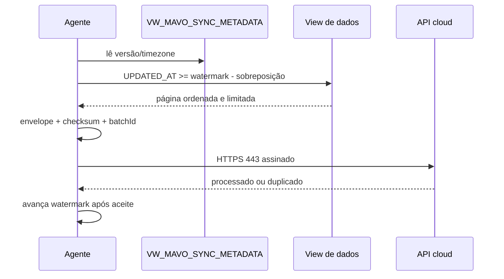

# Contrato das views Firebird

Versão do contrato: `1.0`.

Este documento define a interface que o responsável pelo ERP deverá preparar.
Ele não presume tabelas internas nem fornece SQL específico do cliente. O agente
real futuro terá permissão somente de leitura nessas views.

## Regras gerais

- nomes em caixa alta são a interface recomendada; aliases podem ser mapeados
  na configuração local;
- datas representam o calendário da empresa em `sourceTimezone`;
- timestamps devem conter ou ser convertíveis para o offset correto;
- valores monetários usam decimal, nunca `FLOAT`, com recomendação
  `NUMERIC(19,4)`;
- identificadores de produto precisam ser estáveis ao longo do tempo;
- strings devem vir sem dados pessoais desnecessários;
- cada extração incremental usa `UPDATED_AT` e uma janela de sobreposição;
- o agente divide resultados em lotes de no máximo 5.000 registros e 1 MiB;
- paginação deve ter ordenação estável pela chave natural e `UPDATED_AT`;
- deleção histórica não é inferida pela ausência de uma linha.

## `VW_MAVO_SALES_DAILY`

Uma linha por dia da empresa.

| Campo | Tipo lógico | Obrigatório | Regra |
|---|---|---:|---|
| `SALE_DATE` | `DATE` | sim | chave do dia |
| `GROSS_TOTAL` | `NUMERIC(19,4)` | sim | antes de descontos/cancelamentos |
| `NET_TOTAL` | `NUMERIC(19,4)` | sim | total reconhecido pelo negócio |
| `DISCOUNT_TOTAL` | `NUMERIC(19,4)` | sim | desconto positivo |
| `CANCELLED_TOTAL` | `NUMERIC(19,4)` | sim | cancelamento positivo, separado |
| `SALES_COUNT` | `INTEGER` | sim | vendas válidas segundo a regra acordada |
| `ITEMS_QUANTITY` | `NUMERIC(19,4)` | sim | aceita unidade fracionada |
| `AVERAGE_TICKET` | `NUMERIC(19,4)` | sim | `NET_TOTAL / SALES_COUNT`, zero sem vendas |
| `UPDATED_AT` | `TIMESTAMP` | sim | última recomposição da linha |

Cancelamentos não devem ser subtraídos duas vezes. Se `NET_TOTAL` já exclui
cancelamentos, `CANCELLED_TOTAL` é apenas informativo. Devoluções devem ter uma
política escolhida e documentada pelo cliente: reduzir o dia original ou entrar
como ajuste no dia da devolução. A mesma regra deve permanecer estável.

## `VW_MAVO_PRODUCT_SALES_DAILY`

Uma linha por dia e produto.

| Campo | Tipo lógico | Obrigatório |
|---|---|---:|
| `SALE_DATE` | `DATE` | sim |
| `PRODUCT_ID` | `VARCHAR(200)` | sim |
| `SKU` | `VARCHAR(200)` | não |
| `PRODUCT_NAME` | `VARCHAR(500)` | sim |
| `QUANTITY` | `NUMERIC(19,4)` | sim |
| `GROSS_TOTAL` | `NUMERIC(19,4)` | sim |
| `NET_TOTAL` | `NUMERIC(19,4)` | sim |
| `UPDATED_AT` | `TIMESTAMP` | sim |

Produto sem venda não aparece necessariamente nesta view. Para identificar
baixo giro, o cloud mantém o catálogo observado em períodos anteriores. Uma
view de catálogo explícita poderá ser adicionada em versão futura.

## `VW_MAVO_INVENTORY_ENTRIES_DAILY`

Uma linha por dia e produto com entrada.

| Campo | Tipo lógico | Obrigatório |
|---|---|---:|
| `ENTRY_DATE` | `DATE` | sim |
| `PRODUCT_ID` | `VARCHAR(200)` | sim |
| `SKU` | `VARCHAR(200)` | não |
| `PRODUCT_NAME` | `VARCHAR(500)` | sim |
| `QUANTITY_ENTERED` | `NUMERIC(19,4)` | sim |
| `TOTAL_COST` | `NUMERIC(19,4)` | não |
| `UPDATED_AT` | `TIMESTAMP` | sim |

Transferências, devoluções ao estoque e entradas de compra devem ser
classificadas de forma consistente pelo responsável do ERP. O cloud não tenta
adivinhar a natureza do movimento.

## `VW_MAVO_SYNC_METADATA`

Exatamente uma linha por empresa/configuração.

| Campo | Tipo lógico | Obrigatório | Exemplo |
|---|---|---:|---|
| `SCHEMA_VERSION` | `VARCHAR(20)` | sim | `1.0` |
| `GENERATED_AT` | `TIMESTAMP` | sim | instante da leitura |
| `COMPANY_IDENTIFIER` | `VARCHAR(200)` | sim | ID local não pessoal |
| `TIMEZONE` | `VARCHAR(100)` | sim | `America/Sao_Paulo` |

`COMPANY_IDENTIFIER` é usado para diagnóstico local, nunca para escolher o
tenant cloud. O tenant vem da credencial provisionada.

## Incremental e paginação



Recomendação: sobreposição de 24 horas no `UPDATED_AT` para capturar
reprocessamentos atrasados. Como o cloud faz upsert por chave natural e rejeita
fontes mais antigas, a sobreposição é segura.

## Exemplo genérico

```json
{
  "SALE_DATE": "2026-07-22",
  "GROSS_TOTAL": 10250.75,
  "NET_TOTAL": 9870.5,
  "DISCOUNT_TOTAL": 280.25,
  "CANCELLED_TOTAL": 100,
  "SALES_COUNT": 81,
  "ITEMS_QUANTITY": 442.5,
  "AVERAGE_TICKET": 121.858,
  "UPDATED_AT": "2026-07-23T08:25:00-03:00"
}
```

Antes do agente real, validar amostras com dias sem venda, cancelamento,
devolução, produto renomeado, quantidade fracionada e mudança de horário de
verão/timezone.
