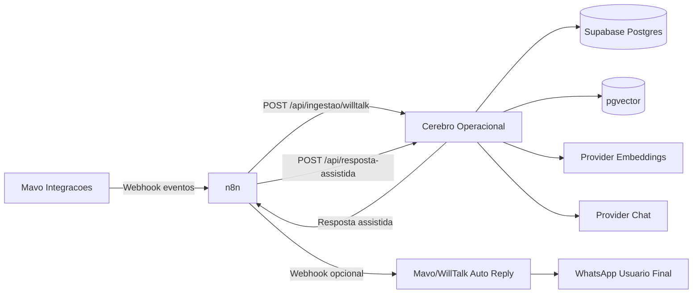
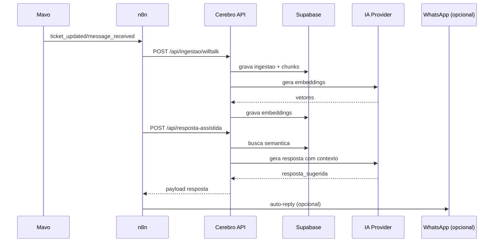

# Integracao Mavo Integracoes + Cerebro Operacional

Versao: 1.0  
Ultima atualizacao: 26/03/2026  
Publico-alvo: Desenvolvimento, Suporte, Operacao, Gestao

## Resumo Executivo
1. Esta integracao transforma conversas de suporte em base pesquisavel com IA e reduz tempo de resposta operacional.
2. O fluxo recomendado e Mavo -> n8n -> Cerebro -> Supabase (pgvector) -> IA -> retorno assistido.
3. A ingestao padroniza tickets em JSON, gera embeddings e habilita busca semantica em segundos.
4. O endpoint de resposta assistida devolve texto pronto com referencias tecnicas para uso interno.
5. O auto-reply em WhatsApp e opcional e deve ser ativado somente com guardrails e monitoramento.
6. A seguranca depende de Bearer token em todos os webhooks e segregacao de segredos por ambiente.
7. O go-live exige indicadores minimos: taxa de sucesso, latencia e taxa de erro por etapa.
8. O desenho suporta crescimento incremental: assistente interno, autoatendimento parcial e feedback loop.
9. A adocao correta reduz retrabalho de N1/N2, melhora consistencia tecnica e cria memoria operacional.

## 1. Visao Geral da Integracao

### Objetivo de negocio
- Acelerar atendimento tecnico com respostas assistidas por IA.
- Reduzir tempo medio de tratamento (TMA) e repeticao de diagnostico.
- Transformar historico operacional em base de conhecimento semantica.

### Escopo tecnico
- Captura de eventos de atendimento no Mavo Integracoes.
- Orquestracao por n8n para validacao, retry e roteamento.
- Ingestao no Cerebro Operacional via `POST /api/ingestao/willtalk`.
- Armazenamento em Supabase (PostgreSQL + pgvector).
- Consulta via `POST /api/busca-semantica`.
- Geracao de sugestao via `POST /api/resposta-assistida`.
- Retorno opcional para WhatsApp via webhook de auto-reply.

### Fluxo macro
- `Mavo -> n8n -> Cerebro -> Supabase -> IA -> retorno para equipe/cliente`.

## 2. Arquitetura Tecnica

### Componentes envolvidos
| Componente | Tipo | Responsabilidade |
|---|---|---|
| Mavo Integracoes | Origem de eventos | Emitir eventos de ticket/mensagem para webhook |
| n8n | Orquestrador | Validar payload, aplicar retry/timeout, chamar APIs |
| Cerebro Operacional | API de inteligencia | Ingerir dados, gerar embeddings, buscar contexto, montar resposta |
| Supabase (Postgres + pgvector) | Persistencia | Salvar tickets/chunks/embeddings e suportar busca vetorial |
| Provider de IA (OpenAI-compatible) | IA | Embeddings e geracao de resposta assistida |
| Endpoint de auto-reply (opcional) | Retorno | Entregar sugestao automatica ao WhatsApp |

### Responsabilidade por camada
- Mavo: fonte de verdade de eventos de atendimento.
- n8n: resiliencia e governanca do trafego entre sistemas.
- Cerebro: logica de conhecimento, NLP, ranking e composicao de resposta.
- Supabase: armazenamento duravel e consultas semanticas.
- IA: inferencia textual e embeddings.

### Diagrama de arquitetura (Mermaid)


### Diagrama de fluxo de dados (Mermaid)


## 3. Pre-requisitos

### Infraestrutura minima
- Mavo Integracoes emitindo webhook HTTP.
- n8n ativo e com URL publica/interna acessivel.
- Cerebro Operacional ativo (API HTTP).
- Supabase provisionado com extensao `vector`.
- Credenciais de IA (chat + embeddings).

### Variaveis de ambiente obrigatorias
#### Cerebro Operacional (`.env`)
```env
NODE_ENV=production
PORT=3000

SUPABASE_URL=https://SEU-PROJETO.supabase.co
SUPABASE_SERVICE_ROLE_KEY=seu_service_role_key
SUPABASE_SCHEMA=cerebro

API_BEARER_TOKEN=trocar_token_forte

EMBEDDING_PROVIDER=openai
EMBEDDING_MODEL=text-embedding-3-small
OPENAI_API_KEY=sk-...

CHAT_PROVIDER=groq
CHAT_MODEL=llama-3.1-70b-versatile
GROQ_API_KEY=gsk_...

INGESTAO_MAX_CHARS=12000
LOG_LEVEL=info
```

#### Mavo/WillTalk (saida + auto-reply)
```env
WILLTALK_WEBHOOK_URL=http://localhost:5678/webhook/willtalk-ingestao
WILLTALK_WEBHOOK_TOKEN=trocar_token_forte
WILLTALK_WEBHOOK_EVENTS=ticket_created,ticket_updated,message_received,message_sent
WILLTALK_WEBHOOK_MAX_CHARS=12000
WILLTALK_WEBHOOK_ATTEMPTS=3
WILLTALK_WEBHOOK_TIMEOUT_MS=8000

WILLTALK_AUTO_REPLY_ENABLED=true
WILLTALK_AUTO_REPLY_ROUTE=/webhooks/cerebro/reply
WILLTALK_AUTO_REPLY_SOURCE=cerebro-operacional
```

#### n8n (recomendado)
```env
N8N_HOST=localhost
N8N_PORT=5678
N8N_PROTOCOL=http
N8N_LOG_LEVEL=info
WEBHOOK_URL=http://localhost:5678/
```

### Permissoes e acessos
- Chave `service_role` no Supabase para escrita em tabelas de ingestao/embeddings.
- Permissao de rede n8n -> Cerebro (`localhost:3000`) e Mavo -> n8n (`localhost:5678`).
- Segredo compartilhado (Bearer) igual em todos os hops que exigirem autenticacao.

## 4. Contratos de API

## 4.1 Endpoint de ingestao
`POST /api/ingestao/willtalk`

Headers:
- `Content-Type: application/json`
- `Authorization: Bearer <API_BEARER_TOKEN>`

Request (exemplo valido):
```json
{
  "ticket_id": "WT-12345",
  "cliente": "Loja XPTO",
  "canal": "whatsapp",
  "mensagens": "2026-03-26T18:30:00Z | cliente: Nao emite NFe\n2026-03-26T18:31:10Z | tecnico: Verifique certificado A1",
  "tecnico": "Maria Souza",
  "data_evento": "2026-03-26T18:30:00Z"
}
```

Response sucesso (exemplo):
```json
{
  "ok": true,
  "ticket_id": "WT-12345",
  "chunks_processados": 4,
  "embeddings_gerados": 4
}
```

Erros esperados:
- `400` payload invalido
- `401` token invalido/ausente
- `500` erro interno (db/ia)

## 4.2 Endpoint de busca semantica
`POST /api/busca-semantica`

Request:
```json
{
  "query": "erro de certificado digital na emissao",
  "top_k": 5,
  "filtros": {
    "canal": "whatsapp",
    "cliente": "Loja XPTO"
  }
}
```

Response:
```json
{
  "ok": true,
  "resultados": [
    {
      "ticket_id": "WT-12345",
      "score": 0.89,
      "trecho": "Renovar certificado A1 e reiniciar servico fiscal",
      "metadata": {
        "cliente": "Loja XPTO",
        "canal": "whatsapp"
      }
    }
  ]
}
```

## 4.3 Endpoint de resposta assistida
`POST /api/resposta-assistida`

Request:
```json
{
  "ticket_id": "WT-12345",
  "pergunta": "Cliente nao consegue emitir NFe com certificado A1",
  "top_k": 5,
  "temperatura": 0.2
}
```

Response:
```json
{
  "ok": true,
  "resposta_sugerida": "1) Validar validade do A1... 2) Reiniciar servico fiscal...",
  "fontes": [
    {
      "ticket_id": "WT-12001",
      "score": 0.87
    }
  ]
}
```

## 4.4 Endpoint opcional de auto-reply WhatsApp
`POST /api/webhooks/cerebro/reply` (lado Mavo/WillTalk)

Request:
```json
{
  "ticket_id": "WT-12345",
  "cliente": "Loja XPTO",
  "canal": "whatsapp",
  "resposta_sugerida": "Passos recomendados...",
  "origem": "cerebro-operacional",
  "data_evento": "2026-03-26T18:30:00Z"
}
```

Resposta esperada:
- `200` enviado
- `200` duplicate_ignored
- `401` token invalido
- `404` ticket nao encontrado
- `502` falha no envio WhatsApp

## 5. Passo a Passo de Implementacao (Hands-on)

## 5.1 Configuracao do Supabase (SQL e validacoes)
1. Abrir SQL Editor do Supabase.
2. Executar script base:

```sql
create extension if not exists vector;
create schema if not exists cerebro;

create table if not exists cerebro.ingestoes (
  id bigserial primary key,
  ticket_id text not null,
  cliente text not null,
  canal text,
  tecnico text,
  mensagens text not null,
  payload jsonb not null,
  hash_payload text not null,
  data_evento timestamptz not null default now(),
  created_at timestamptz not null default now()
);

create unique index if not exists ux_ingestoes_ticket_hash
  on cerebro.ingestoes(ticket_id, hash_payload);

create table if not exists cerebro.chunks (
  id bigserial primary key,
  ingestao_id bigint not null references cerebro.ingestoes(id) on delete cascade,
  ticket_id text not null,
  chunk_index int not null,
  chunk_text text not null,
  metadata jsonb not null default '{}'::jsonb,
  created_at timestamptz not null default now()
);

create index if not exists idx_chunks_ticket_id on cerebro.chunks(ticket_id);

create table if not exists cerebro.embeddings (
  id bigserial primary key,
  chunk_id bigint not null references cerebro.chunks(id) on delete cascade,
  ticket_id text not null,
  embedding vector(1536) not null,
  created_at timestamptz not null default now()
);

create index if not exists idx_embeddings_ticket_id on cerebro.embeddings(ticket_id);
create index if not exists idx_embeddings_vector
  on cerebro.embeddings using ivfflat (embedding vector_cosine_ops) with (lists = 100);
```

3. Validacoes SQL:
```sql
-- extensao ativa
select extname from pg_extension where extname = 'vector';

-- estrutura criada
select table_name
from information_schema.tables
where table_schema = 'cerebro'
order by table_name;

-- dimensao dos vetores
select count(*) as vetores_invalidos
from cerebro.embeddings
where vector_dims(embedding) <> 1536;

-- ultimas ingestoes
select ticket_id, cliente, created_at
from cerebro.ingestoes
order by created_at desc
limit 20;
```

## 5.2 Configuracao do Cerebro Operacional
1. Criar `.env` (usar bloco da secao 3).
2. Instalar dependencias e subir API:
```bash
npm ci
npm run dev
```
3. Em ambiente produtivo:
```bash
npm ci
npm run build
npm run start
```
4. Testar token e endpoint de ingestao:
```bash
curl -i -X POST "http://localhost:3000/api/ingestao/willtalk" \
  -H "Content-Type: application/json" \
  -H "Authorization: Bearer trocar_token_forte" \
  -d '{"ticket_id":"WT-00001","cliente":"Teste","mensagens":"Teste de ingestao"}'
```

## 5.3 Configuracao do n8n
Workflow recomendado: `Mavo_Ingestao_Cerebro_v1`

Nodes:
1. `Webhook Trigger`
2. `Function - Normalizar Payload`
3. `IF - Campos obrigatorios`
4. `HTTP Request - Ingestao Cerebro`
5. `HTTP Request - Resposta Assistida` (quando aplicavel)
6. `HTTP Request - Auto Reply Mavo` (opcional)
7. `Error Trigger/Notificacao`

Configuracao minima do `HTTP Request - Ingestao Cerebro`:
- Method: `POST`
- URL: `http://localhost:3000/api/ingestao/willtalk`
- Headers:
  - `Content-Type: application/json`
  - `Authorization: Bearer {{ $env.API_BEARER_TOKEN }}`
- Timeout: `15000ms`
- Retry: `3`
- Retry interval: `1000ms` (exponencial recomendado)

Function de normalizacao (exemplo):
```javascript
const src = $json.body ?? $json;
return [{
  json: {
    ticket_id: src.ticket_id ?? src.id ?? "",
    cliente: src.cliente ?? src.contact_name ?? "Cliente sem nome",
    canal: (src.canal ?? "whatsapp").toLowerCase(),
    mensagens: src.mensagens ?? src.historico ?? "[sem mensagens relevantes]",
    tecnico: src.tecnico ?? "",
    data_evento: src.data_evento ?? new Date().toISOString()
  }
}];
```

## 5.4 Configuracao no Mavo Integracoes
1. Configurar webhook de saida para n8n:
- URL: `http://localhost:5678/webhook/willtalk-ingestao`
- Metodo: `POST`
- Header: `Authorization: Bearer trocar_token_forte`
- Header: `Content-Type: application/json`

2. Habilitar eventos:
- `ticket_created`
- `ticket_updated`
- `message_received`
- `message_sent`

3. Mapeamento de payload no Mavo:
| Origem Mavo | Destino Cerebro |
|---|---|
| `ticket.id` | `ticket_id` |
| `contact.name` | `cliente` |
| `channel` | `canal` |
| `conversation_text` | `mensagens` |
| `assignee.name` | `tecnico` |
| `updated_at` | `data_evento` |

4. Habilitar auto-reply (opcional):
- `WILLTALK_AUTO_REPLY_ENABLED=true`
- Rota: `http://localhost:4002/api/webhooks/cerebro/reply`
- Mesmo Bearer token compartilhado.

## 5.5 Testes ponta a ponta (curl e PowerShell)

### Teste 1: Mavo -> n8n (simulacao webhook de origem)
```bash
curl -i -X POST "http://localhost:5678/webhook/willtalk-ingestao" \
  -H "Content-Type: application/json" \
  -H "Authorization: Bearer trocar_token_forte" \
  -d '{
    "ticket_id": "WT-12345",
    "cliente": "Loja XPTO",
    "canal": "whatsapp",
    "mensagens": "Cliente sem emissao de NFe",
    "tecnico": "Joao",
    "data_evento": "2026-03-26T18:30:00Z"
  }'
```

### Teste 2: busca semantica
```bash
curl -i -X POST "http://localhost:3000/api/busca-semantica" \
  -H "Content-Type: application/json" \
  -H "Authorization: Bearer trocar_token_forte" \
  -d '{
    "query": "erro certificado digital",
    "top_k": 3
  }'
```

### Teste 3: resposta assistida
```bash
curl -i -X POST "http://localhost:3000/api/resposta-assistida" \
  -H "Content-Type: application/json" \
  -H "Authorization: Bearer trocar_token_forte" \
  -d '{
    "ticket_id": "WT-12345",
    "pergunta": "Qual procedimento para corrigir erro de certificado?",
    "top_k": 5,
    "temperatura": 0.2
  }'
```

### Teste PowerShell (ingestao direta)
```powershell
$headers = @{
  "Content-Type" = "application/json"
  "Authorization" = "Bearer trocar_token_forte"
}

$body = @{
  ticket_id   = "WT-12345"
  cliente     = "Loja XPTO"
  canal       = "whatsapp"
  mensagens   = "Cliente sem emissao de NFe"
  tecnico     = "Joao"
  data_evento = "2026-03-26T18:30:00Z"
} | ConvertTo-Json

Invoke-RestMethod -Method Post -Uri "http://localhost:3000/api/ingestao/willtalk" -Headers $headers -Body $body
```

## 5.6 Criterios de aceite tecnico
- Ingestao valida retorna `200/202` e persiste registros em `cerebro.ingestoes`.
- Cada ingestao gera chunks e embeddings sem erro de dimensao.
- Busca semantica retorna itens com score e trecho.
- Resposta assistida retorna `resposta_sugerida` com fontes.
- Workflow n8n trata retry em falhas transientes.
- Auto-reply (se habilitado) envia mensagem WhatsApp e evita duplicidade.
- Logs com correlacao por `ticket_id` em todos os componentes.

## 6. Seguranca e Governanca

### Gestao de segredos
- Nao versionar `.env` com segredos reais.
- Usar cofre de segredos por ambiente (dev/hml/prod).
- Chave separada por sistema (Mavo, n8n, Cerebro).

### Validacao de Bearer token
- Exigir Bearer em:
  - Mavo -> n8n
  - n8n -> Cerebro
  - Cerebro/n8n -> auto-reply
- Rejeitar sem token com `401`.

### Rotacao de chaves
- Periodicidade recomendada: 90 dias.
- Janela de rotacao: manter token antigo por 24h com plano de rollback.
- Registrar responsavel e data da ultima rotacao.

### Logs e auditoria
- Logar: `ticket_id`, endpoint, status HTTP, latencia, erro resumido.
- Nao logar dados sensiveis desnecessarios (CPF, cartao, senha).
- Retencao minima recomendada: 90 dias.

### Boas praticas LGPD
- Coletar somente dados necessarios para suporte tecnico.
- Mascarar identificadores pessoais em prompts e logs.
- Definir politica de retencao e descarte seguro.
- Permitir trilha de auditoria de acesso e processamento.

## 7. Operacao e Monitoramento

### Monitoramento minimo
- Taxa de sucesso de ingestao (%).
- Taxa de erro por endpoint (%).
- Tempo medio de resposta por endpoint (p95).
- Volume de tickets processados por hora.
- Tempo entre evento recebido e resposta assistida pronta.

### Indicadores recomendados
| Indicador | Meta inicial | Alerta |
|---|---:|---:|
| Sucesso ingestao | >= 98% | < 95% (5 min) |
| Erro 5xx Cerebro | < 1% | >= 3% (5 min) |
| Latencia p95 ingestao | < 2s | > 5s |
| Latencia p95 resposta assistida | < 4s | > 8s |
| Falha auto-reply | < 2% | >= 5% |

### Alertas operacionais
- n8n fila de erro > 10 eventos em 5 min.
- Supabase indisponivel/timeout.
- Falha de provider IA por mais de 3 tentativas.
- Token invalido recorrente (possivel problema de segredo ou tentativa indevida).

## 8. Troubleshooting

| Sintoma | Causa provavel | Acao corretiva |
|---|---|---|
| Webhook nao registrado no n8n | URL errada ou workflow inativo | Validar URL, ativar workflow, testar com curl |
| `401 token invalido` | Token divergente entre origem/destino | Revalidar `.env` em todos os sistemas e reiniciar servicos |
| `400 payload invalido` | Campos obrigatorios ausentes | Normalizar payload no node Function antes do HTTP Request |
| `500 falha IA` | Timeout/provider indisponivel | Aplicar retry no n8n, reduzir `top_k`, verificar quota/chave |
| Embeddings ausentes | Falha no provider de embeddings ou dimensao incorreta | Validar `EMBEDDING_MODEL`, checar logs e query de vetores |
| Encoding quebrado (acentuacao) | Charset incorreto no payload/log | Forcar UTF-8 no `Content-Type` e revisar serializacao JSON |

## Runbook de Incidente (acoes em 15 minutos)

### Minuto 0-5: conter impacto
1. Confirmar escopo: ingestao, busca, resposta assistida ou auto-reply.
2. Pausar auto-reply se houver risco de resposta incorreta em massa.
3. Validar status dos servicos (`Mavo`, `n8n`, `Cerebro`, `Supabase`).

### Minuto 5-10: diagnostico rapido
1. Executar curl de ingestao direto no Cerebro.
2. Verificar logs por `ticket_id` nas ultimas falhas.
3. Rodar SQL rapido:
```sql
select ticket_id, created_at
from cerebro.ingestoes
order by created_at desc
limit 10;
```

### Minuto 10-15: restaurar
1. Se token invalido: corrigir segredo e reiniciar processo.
2. Se n8n falhou: reprocessar itens da fila de erro.
3. Se IA instavel: trocar provider fallback (quando disponivel) e reduzir carga.
4. Comunicar status para Gestor com ETA e impacto.

## RACI simplificada

| Atividade | Dev | Suporte | Operacao | Gestor |
|---|---|---|---|---|
| Definir contrato de payload | R/A | C | I | I |
| Configurar n8n e retries | R | I | A | I |
| Provisionar Supabase e pgvector | C | I | R/A | I |
| Validar testes ponta a ponta | R | R | C | I |
| Monitorar producao | C | R | A | I |
| Decisao de rollback | C | I | R | A |

Legenda: `R` Responsible, `A` Accountable, `C` Consulted, `I` Informed.

## 9. Plano de Evolucao

### Fase 1: assistente interno
- Resposta assistida apenas para equipe tecnica.
- Sem auto-envio ao cliente.
- Meta: confiabilidade e padronizacao de diagnostico.

### Fase 2: autoatendimento WhatsApp com guardrails
- Habilitar auto-reply para casos de baixa complexidade.
- Aplicar regras de bloqueio por palavra-chave critica.
- Escalonamento automatico para humano em baixa confianca.

### Fase 3: feedback loop de qualidade e ranking
- Capturar feedback de utilidade da resposta.
- Ajustar ranking semantico com sinais de resolucao real.
- Medir ganho por categoria de incidente e cliente.

## 10. Checklist Final de Go-Live

### Checklist tecnico
- [ ] Supabase com `vector` ativo e tabelas criadas.
- [ ] Endpoints do Cerebro respondendo com token valido.
- [ ] Workflow n8n ativo com retry/timeout configurado.
- [ ] Mavo enviando eventos obrigatorios.
- [ ] Teste E2E aprovado para ingestao, busca e resposta assistida.

### Checklist operacional
- [ ] Dashboard com indicadores minimos publicado.
- [ ] Alertas configurados (erro, latencia, fila).
- [ ] Time de suporte treinado no fluxo de fallback manual.
- [ ] Runbook validado em simulacao.

### Checklist seguranca
- [ ] Segredos fora de repositório.
- [ ] Bearer token validado em todos os hops.
- [ ] Politica de rotacao definida e registrada.
- [ ] Logs sem dados pessoais desnecessarios (LGPD).
- [ ] Auditoria por `ticket_id` ativa ponta a ponta.
