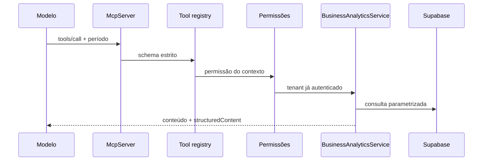

# Ferramentas MCP de negócio

## Implementação

O servidor usa o SDK TypeScript oficial `@modelcontextprotocol/sdk` v1, linha
estável no momento desta entrega. Não existe emulação do protocolo. O processo
usa transporte stdio e só inicia quando `MAVO_MCP_ENABLED=true`.

```bash
MAVO_MCP_ENABLED=true \
MAVO_MCP_ORGANIZATION_ID=org_xxx \
MAVO_MCP_ACCESS_USER_ID=business_user_xxx \
npm run mcp:business
```

Os dois IDs são configuração confiável do processo, não argumentos enviados
pelo modelo. O servidor carrega o usuário ativo, calcula permissões e constrói
o contexto. Em produção, execute uma instância MCP por contexto confiável ou
adicione uma camada de autenticação de transporte antes de expor MCP remoto.

## Registry

| Ferramenta | Permissão |
|---|---|
| `get_sales_total` | `finance.read` |
| `get_sales_count` | `sales.read` |
| `get_average_ticket` | `finance.read` |
| `get_average_daily_sales` | `finance.read` |
| `get_sales_by_day` | `finance.read` |
| `get_sales_by_weekday` | `finance.read` |
| `get_top_selling_products` | `sales.read` |
| `get_low_selling_products` | `sales.read` |
| `get_inventory_entries` | `inventory.read` |
| `compare_sales_periods` | `finance.read` |
| `get_business_summary` | `finance.read` |
| `get_data_freshness` | `sales.read` |

Cada definição contém descrição, Zod/JSON Schema, limite de 1 a 20 itens quando
aplicável, permissão e retorno estruturado.

Nenhuma ferramenta aceita:

- `organization_id`;
- SQL;
- nome de tabela;
- comando de escrita;
- credencial.

Schemas são estritos; campos extras são recusados.



Todas as chamadas chegam ao mesmo `BusinessAnalyticsService` usado pelo
WhatsApp e pela UI, logo obedecem limites, timezone, tenant e auditoria.

## Exemplo

Entrada:

```json
{"period":"últimos 7 dias"}
```

Também são aceitos `from` e `to` juntos no formato `YYYY-MM-DD`. Para comparação,
o período anterior é calculado com a mesma quantidade de dias, salvo quando
`previousFrom` e `previousTo` forem fornecidos.

Falhas de permissão e payload geram erro controlado. Resultados vazios são
retornados como dados vazios; o modelo não deve inventar valores.

## Operação segura

- `MAVO_MCP_ENABLED=false` é o padrão;
- não iniciar MCP automaticamente junto ao Web Service;
- não registrar totais financeiros completos nos logs;
- revogar/desativar o usuário gerencial bloqueia uma nova inicialização;
- não criar ferramenta `execute_sql`;
- qualquer futuro transporte HTTP deverá autenticar cada conexão e derivar o
  tenant do principal autenticado.
