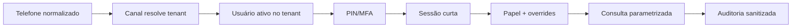

# Segurança do acesso gerencial

## Modelo de confiança

O telefone é somente um identificador inicial. O acesso exige:

1. vínculo ativo em `business_access_users` do tenant resolvido pelo canal;
2. PIN bcrypt ou provedor MFA futuro;
3. sessão não expirada e não revogada;
4. permissão para a consulta;
5. filtro `organization_id` e auditoria.



Um telefone cadastrado na organização A não é procurado globalmente e não pode
obter contexto da organização B.

## Papéis

| Permissão | owner | director | manager | analyst |
|---|:---:|:---:|:---:|:---:|
| vendas | sim | sim | sim | sim |
| financeiro | sim | sim | não | não |
| estoque | sim | sim | sim | não |
| auditoria | sim | sim | não | não |
| gestão de acessos | sim | não | não | não |

Overrides explícitos podem conceder ou negar itens. As rotas administrativas da
SPA continuam restritas ao papel de aplicação `admin`.

## PIN, sessão e MFA

- PIN: 6 a 12 dígitos, bcrypt custo 12;
- máximo padrão: 5 falhas;
- bloqueio padrão: 15 minutos;
- sessão padrão: 15 minutos;
- renovação apenas após consulta autorizada;
- reset de PIN revoga sessões;
- segredo, PIN, JWT e assinatura nunca são logados.

As sessões gerenciais ficam no PostgreSQL porque revogação imediata, auditoria
e integridade referencial são requisitos autoritativos. O Render Key Value é
usado para rate limit, nonce, locks e deduplicação; ele não é uma fonte
alternativa de autorização. Uma camada Redis futura poderá atuar somente como
cache com invalidação explícita, nunca como fallback silencioso.

O contrato `BusinessMfaProvider` suporta `pin`, `totp`, `email_code` e
`external`. Para o MVP, somente PIN está habilitado. Um código enviado para o
mesmo WhatsApp não é segundo fator independente: ele comprova controle do mesmo
canal já usado e não satisfaz MFA forte. TOTP, e-mail verificado separado ou
provedor externo são as evoluções adequadas.

## API, sessão web e CORS

- `JWT_SECRET` é obrigatório e deve ter pelo menos 32 caracteres em produção;
- cookie é `httpOnly`, `secure` em produção e configurável para `SameSite=None`
  quando SPA e API usam hosts distintos;
- cada request revalida usuário ativo;
- login, PIN, agente e consultas possuem rate limit;
- CORS usa allowlist exata; não existe `origin: "*"`;
- erros ao cliente são sanitizados e não incluem stack/SQL.

## Socket.IO

O handshake valida o JWT do cookie, extrai `organizationId` e `userId` da
assinatura e ingressa em `organization:<id>`. O navegador não escolhe a sala.
Eventos e typing usam somente essa sala; não há `io.emit` de payload de tenant.

## PostgreSQL e RLS

Todas as novas tabelas de tenant têm `organization_id`, FKs compostas quando
necessário e índices de tenant/data. Consultas usam parâmetros.

Policies `mavo_tenant_isolation_*` exigem:

```sql
organization_id = mavo_current_organization_id()
```

O backend define `app.organization_id` nas transações sensíveis. A conexão
privilegiada necessária para localizar a credencial do agente ainda depende dos
filtros explícitos e deve ser usada apenas pelo backend. O Data API público não
recebe service role e, sem contexto, as policies negam as tabelas.

Teste recomendado com um papel PostgreSQL não owner:

```sql
BEGIN;
SELECT set_config('app.organization_id', 'org_a', true);
SELECT COUNT(*) FROM business_sales_daily
 WHERE organization_id = 'org_b'; -- deve retornar zero/ser negado
ROLLBACK;
```

## Agente

- HMAC-SHA256 com segredo individual;
- segredo cifrado em repouso;
- timestamp e tolerância de relógio;
- nonce em Redis com fallback PostgreSQL;
- checksum do array de registros;
- tamanho e rate limit;
- `batchId` único por agente;
- tenant derivado da credencial;
- rotação e revogação auditadas.

## Logs

Campos permitidos incluem `request_id`, `organization_id`, `agent_id`,
`batch_id`, `query_type`, `duration_ms`, estado e código de erro sanitizado.
Não registrar conteúdo sensível de mensagem, PIN, segredo, token completo,
assinatura completa ou resultado financeiro detalhado.

## Riscos residuais aceitos no MVP

- `whatsapp-web.js` é um canal não oficial e requer sessão local/disco;
- o disco força uma instância e deploy com breve interrupção;
- policies RLS são uma segunda barreira, mas o backend direto ainda usa papel
  privilegiado para autenticação do agente;
- eventuais exportações históricas do Firestore precisam ser tratadas fora do
  runtime; o provider e sua dependência foram removidos;
- disponibilidade do rate limit em produção depende do Render Key Value; a API
  falha de forma controlada quando não pode aplicar a proteção.

## Dependências

Na auditoria de 23/07/2026 não há vulnerabilidades críticas. A SPA tem zero
achados. O backend mantém cinco avisos transitivos sem correção estável
compatível: três altos agregados pelo Next.js (`postcss`/`sharp`) e dois
moderados do transporte HTTP do SDK MCP (`@hono/node-server`). O MCP entregue
usa somente `stdio` em Linux e não expõe `serve-static`; CSS de build é
controlado pelo repositório e a aplicação não usa o pipeline de imagens do
Next nas novas telas. Não foi aplicado downgrade inseguro nem override de
versão major fora da faixa suportada. Reavaliar a cada atualização estável do
Next e do SDK MCP.
